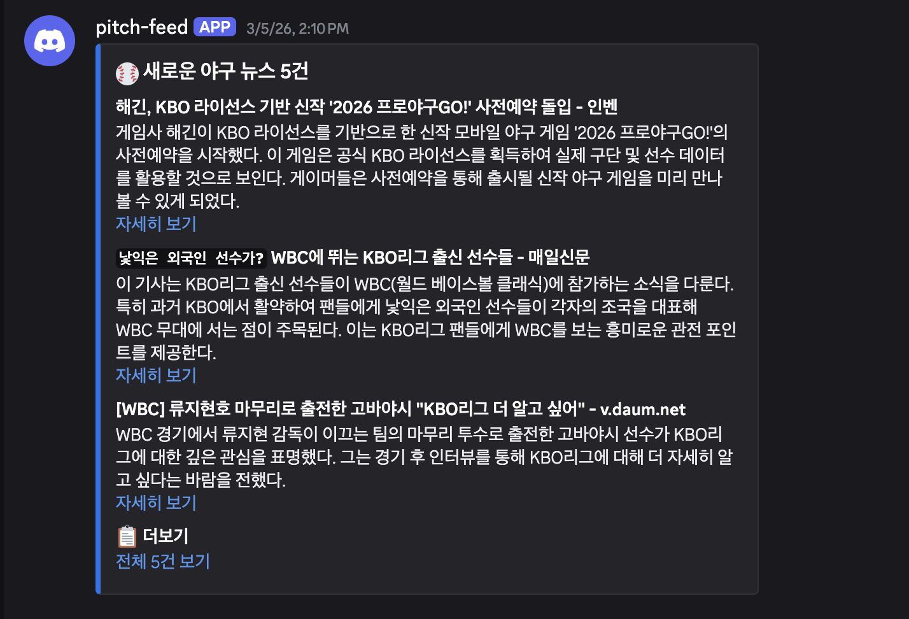
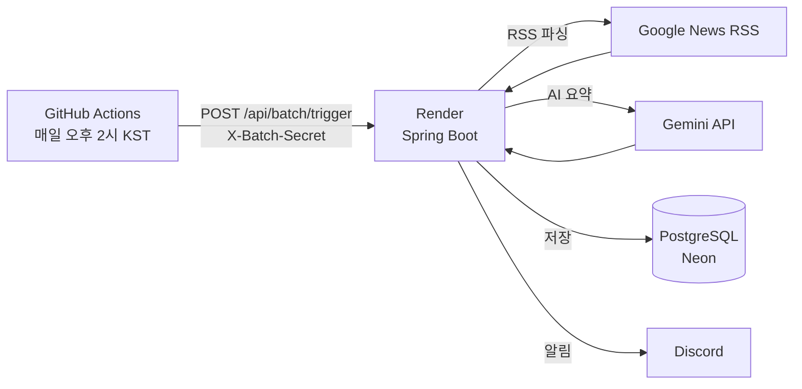

**귀찮음에서 시작된 프로젝트**
어느 순간부터 포털에 접속하지 않는다. 요즘은 구글링보다 AI에게 직접 묻는 경우가 더 많다. 의도적으로 포털에 접속해서 뉴스 메뉴를 들어가지 않는 이상 뉴스를 볼 일이 없다. 하지만 2026년에 사는 현대인으로서 세상의 소식을 놓치고 살 순 없다. 요즘 뉴스를 접할 수 있는 채널은 SNS 피드나 메일링 서비스 두 가지인 것 같다. 하지만 그 두가지 모두 내 맘에 쏙 드는 것은 아니다. 내가 원하는 관심사의 뉴스를 가볍게 받아보고 싶었다. 최근의 내 관심사는 야구. 특히 스토브리그 기간이나 WBC같은 국제대회를 앞두고서는 흥미로운 뉴스가 넘쳐난다. 그러나 매번 SNS 에 누가 피드를 올려주기를 기다리거나 직접 포털에 접속하는건 너무 귀찮다. 매일 접속해 있는 메신저에서 그냥 하루에 한 번 만이라도 대강 뉴스 요약해서 올려주면 좋을텐데!

---

**RSS를 선택한 이유**
뉴스를 가져오는 방법은 여러 가지이다. 크롤링,공식 API, RSS. 크롤링은 사이트 구조가 바뀌면 깨진다. 공식 API는 대부분 유료거나 없다. RSS는 오래된 기술이지만 구조가 표준화되어 있어 파싱해서 쓰기가 편하고, 빠르게 만들 수 있다.

그런데 막상 RSS로 가져오려다 보니 문제가 있었다. 국내 주요 뉴스 포털은 RSS를 더이상 지원하지 않는다. 네이버 스포츠, 다음 스포츠 모두 RSS를 제공하지 않는다. 결국 선택한 것은 구글 뉴스 RSS였다. 구글 뉴스는 검색어 기반으로 RSS 피드를 제공하기 때문에 KBO, MLB 같은 키워드로 원하는 뉴스를 필터링 할 수 있었다. 처음 의도와는 다른 경로였지만, 목적은 충분히 달성했다.

---

**구현하면서 고민했던 지점들**
1. 배치 실행을 어떻게 트리거 할 것인가?

	배포 환경은 Render를 사용했다. 무료 티어는 일정 시간 후 슬립 상태에 들어간다. 서버 내부에 cron을 설정하면 슬립 상태에서는 동작하지 않는다. 그러면 서버를 트리거 해주는 것이 있으면 되겠다 싶어서 Github Actions를 사용하기로 했다.
	GitHub Actions가 HTTP 요청으로 서버를 깨우고 배치를 실행한다. 배치 엔드포인트는 X-Batch-Secret 헤더로 인증해 무단 실행을 막았다.

2. AI 응답을 어떻게 파싱할 것인가?

	Spring AI로 Gemini에게 기사 요약을 요청한다. 프롬포트에 응답 형식을 다음과 같이 명시해 응답을 줄 단위로 파싱해서 `요약:, 태그:` 접두어를 기준으로 값을 추출한다. 
	
	요약: (3문장 이내)
	태그: (키워드 3~5개, 콤마 구분)
	
	형식이 맞지 않으면 null로 저장하고 넘어간다. 요약 실패가 전체 배치를 막아서는 안 된다고 판단했기 때문이다.

---

**회고**

일단 만들어보자 하고 아는(?)기술, 안 써본 기술 다 때려 넣다 보니 미니미한 프로젝트 규모에 비해 과한 기술을 사용하게되었다.
1. **Spring Batch은 오버 스펙**

	RSS를 파싱하고 저장하는 단순 반복 작업은 @Scheduled 로도 충분했다. Spring Batch가 진가를 발휘하는 것은 수만 건의 데이터를 청크 단위로 처리하거나, 중간 실패 시 해당 지점부터 재시작해야할 때인데, 이 프로젝트는 사실 그런 상황과 거리가 멀다.
	
2. **Spring AI도 그냥 겉핥기**

	chatClient로 프롬포트를 보내고 응답을 받는 것이 전부인 프로젝트여서, 그냥 restClient로 gemini API를 호출해도 됐는데, spring ai가 뭔가 혹해서 사용하게 되었다. 결론적으로 "LLM API 호출을 Spring AI로 감쌌다"는 표현이 더 적합한 상황이 되었다.
	그래도 spring ai의 도입한 이점을 굳이 찾아 내자면
	
	- 모델 교체가 쉽다 : application.yaml에서 모델명만 바꾸면 Gemini → GPT → Claude 전환이 가능(RestClient 직접 호출이면 요청 형식도 같이 바꿔야함)
	- 설정이 자동화 : API 키, base-url만 주입하면 ChatClient 빈이 자동 생성

그렇지만 토이프로젝트인데 조금(?) 과하게 쓴 것이 무엇이 문제가 되겠는가. 원하던 목적은 달성했다. 가장 졸리고 나른할 2시 즈음에 뉴스를 받아볼 수 있는것이다. 

그래도 아쉬우니 다음 프로젝트에서는 Spring AI를 제대로 활용할 수 있는 토이 프로젝트를 해보려고 한다.

