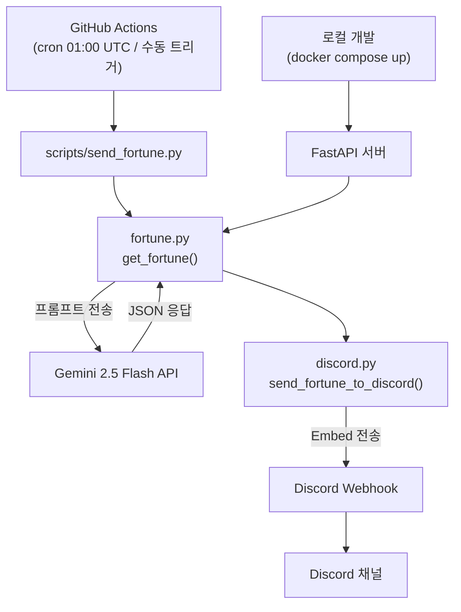
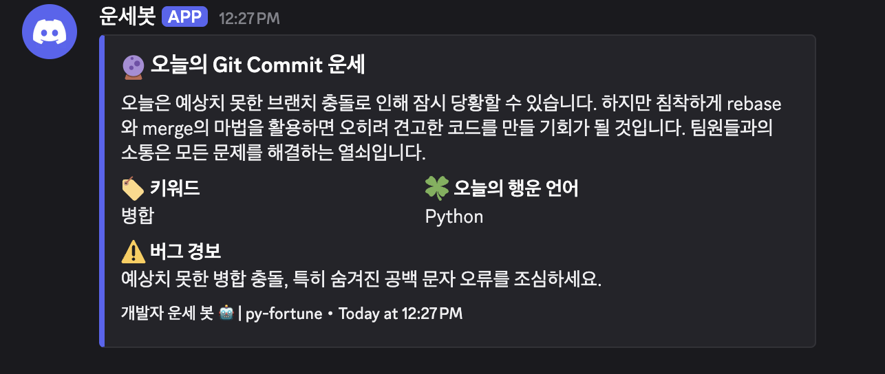

## Deploy First, pray later

취업이 생각만큼 빨리 되고 있지 않고 있다. 나름대로 열심히 이력서를 쓰고, 지원을 해도 서류가 떠러지고, 면접도 잘 봤다고 생각했지만 합격 두 글자가 따라오지 않는다. 이럴 때는 어쩔 수 없이 '기도 메타'가 필요하다. 일단 배포 먼저 하고, 잘되길 기도하는 것처럼. 비과학적인 것인걸 알지만 오늘의 운세가 좋다고 하면 잘 풀릴거 같은 기분이 들어서 혹시나 하는 맘에 매번 오늘의 운세를 찾아 보게 된다.

매일 오늘의 운세를 찾아 읽다보니, 운을 찾아 다니기 보다는 운이 나를 따르게 해야 할 것 같은 생각이 들었다. 그리고 우울 할땐 결과가 바로바로 나오는 그런 일이 필요하다. 그래서 소소하게 즐거울 *오늘의 개발 운세* 를 디스코드로 보내주는 알림봇을 만들기로 했다.(사실 봇은 아님)

---

## 구조

서버를 따로 띄우지 않았다. 수입이 없는 상태에서는 작은 서버비도 아쉽다. 그리고 나혼자 보는건데 이정도면 GitHub Actions cron으로 스케줄링 하면 무료 플랜 안에서 해결 가능하다.

FastAPI로 REST API도 만들었는데, 결론적으로는 GitHub Actions에서는 쓰지 않는다. 로컬에서 수동으로 확인하거나 테스트할 때 만 쓰게 됐다.

---

## 운세 생성

Gemini 2.5 Flash API로 매일 새로운 운세를 생성한다. 처음에는 정적 데이터를 쓰려고 했는데 그러면 같은 문장이 반복되 재미가 반감될 것 같아서 바꿨다.

응답은 JSON 형식으로만 받도록 프롬프트를 고정했는데, 모델이 가끔 마크다운 코드블록(
`json`)으로 감싸서 응답하는 경우가 있다. 그냥 파싱하면 에러가 나기 때문에코드블록을 걷어내는 처리를 추가했다.

Rate limit(429)이 걸리면 60초, 120초 간격으로 최대 3회 재시도한다. GitHub Actions에서 cron으로 돌리는 특성상 실패하면 그날 운세가 없어지기 때문이다.

---

## 운이 나에게 왔을까?

진짜 행운은 몰라도 운세 알림은 와줬다.

굳이 쓰지 않아도 됐지만 써본 파이썬은 자바와 다르게 의존성 주입이나 프로젝트 세팅이 비교적 단순해서 편했다.

돌아보면 FastAPI는 이 프로젝트에 과한 선택이었다. GitHub Actions에서 직접 스크립트를 실행하는 구조라 FastAPI 서버가 실제 흐름에 끼어들 자리가 없다. 로컬 테스트용 엔드포인트가 필요했다면 Flask로 충분했고, 사실 python scripts/send_fortune.py만으로도 테스트는 됐다.

Python 입문 겸 FastAPI를 써보고 싶었던 게 솔직한 이유지만 토이프로젝트인데 뭐 어떤가 싶다.기술 선택의 근거가 타당하려면 프로젝트 규모와 기술의 특장점을 더 면밀히 따져야하는 것이 정석이지만, 기분 전환이 됐다는 것으로 이 토이 프로젝트는 그 역할을 다 한 것이다. 일단 행운 메시지는 매일 오고 있으니까.