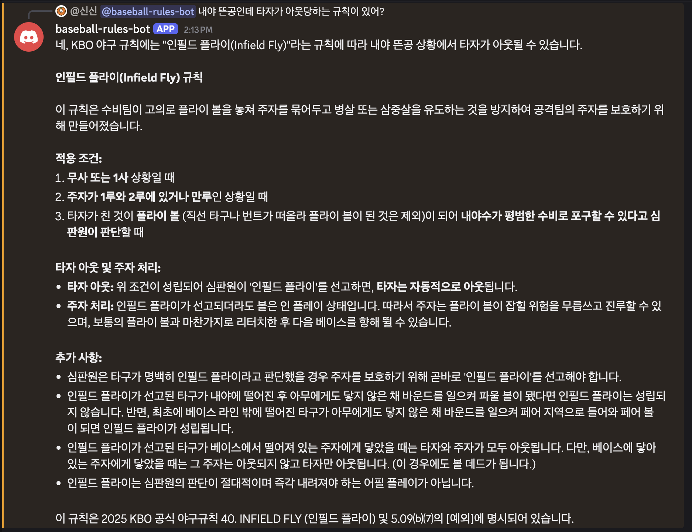
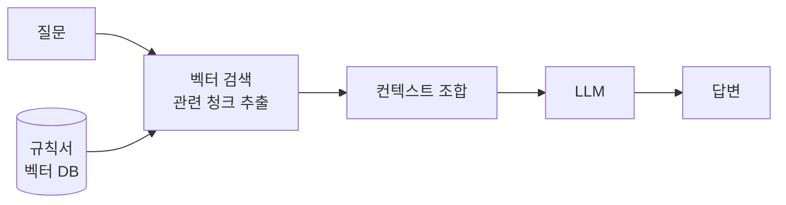
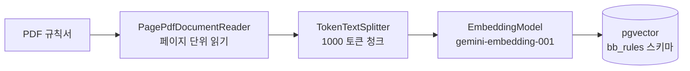

## 그게 진짜 존재하는 규칙일까요?

야구를 보다 보면 가끔 "저게 맞는 건가?" 싶은 장면이 나온다. 2사 만루에서 볼넷 던지기 직전에 주자가 주루사 당하면 타자는 어떻게 되는지, 보크가 정확히 어떤 상황인지. 구글링을 해보면 각종 커뮤니티 답변이 나오긴 하는데, 진짜 규칙서에 근거한 답인지 확신하기가 어렵다.

KBO에서 제공하는 공식 규정집이 있다. 그렇다고 매번 PDF를 찾아 보긴 너무 번거롭고 귀찮다. 구글링은 잘못된 정보도 있을 수 있으니 규정집을 바탕으로 궁금한 상황을 물어보면 알려주는 봇이 있었으면 좋겠다고 생각하게 됐다.

전문적인 용어는 잘 모르지만 *찰떡같이*  알아서 규칙을 대답해주길 바랬다.




---

## RAG 이란?

### LLM 만으로 안 되는 이유

ChatGPT나 Gemini한테 야구 규칙을 물어보면 그럴듯한 답이 나온다. 그런데 두 가지 문제가 있다.

첫째, *근거가 없다.*  LLM은 학습 데이터에서 통계적으로 그럴듯한 텍스트를 생성한다. 규칙서를 직접 참조하는 게 아니라 인터넷에 있는 수많은 야구 관련 글에서 패턴을 학습한 것이다. 틀릴 수 있고, 틀려도 자신 있게 말한다.

둘째, *최신 규정을 모른다.* 학습 데이터 이후에 개정된 규칙은 알 수 없다. 
### RAG을 생각하게 된 이유

RAG(Retrieval Augmented Generation)은 위의 두 가지 문제를 우회 할 수 있다.

질문 → 관련 문서 검색 → 검색된 내용 + 질문을 LLM에 전달 → 답변

LLM이 "알고 있는 것"으로 답하는 게 아니라, 검색해서 가져온 실제 문서를 바탕으로 답하게 한다.





### 의미 기반 검색

RAG의 핵심은 **벡터검색** 이다. 키워드 검색은 "보크"라는 단어가 있는 문서를 찾지만, 의미 기반 검색은 "투수가 주자를 속이는 반칙 동작"이라고 물어도 보크 관련 규칙을 찾는다.

텍스트를 수백~수천 차원의 숫자 벡터로 변환(임베딩)해서, 의미가 비슷한 텍스트는 벡터 공간에서 가까운 위치에 놓이게 된다. 이 거리를 계산해 가장 관련 있는 문서를 찾는 것이다.


| 방식         | 동작           | 한계                  |
| :--------- | :----------- | :------------------ |
| 키워드 검색     | 단어 매칭        | 표현이 다르면 못 찾음        |
| 의미 검색(RAG) | 벡터 유사도       | 관련 문서가 DB에 없으면 못 찾음 |
| LLM 단독     | 학습 데이터 기반 생성 | 근거 없음, 환각 가능        |

### 핵심 구성 요소

- **EmbeddingModel** : 변환된 벡터를 저장하고 유사도 검색을 제공하는 저장소. Spring AI가 추상화 레이어를 제공해서 구현체를 바꿔도 코드가 바뀌지 않는다.

- **Vectorstore:** 텍스트를 벡터로 변환하는 AI 모델. 이 프로젝트에서는 gemini-embedding-001을 사용했다.

- **pgvector:** PostgreSQL의 벡터 확장. 별도의 벡터 DB 없이 기존 DB에서 벡터를 저장하고 검색할 수 있다. 이 프로젝트의 vectorStore 구현체로 사용했다.

그렇다면 EmbeddingModel만 있다면 LLM은 없어도 되는 걸까? 엄밀히 말하면 그건 **시멘틱 검색**이다.

|        | EmbeddingModel | LLM |
| ------ | :------------: | :-: |
| 시멘틱 검색 |       필요       | 불필요 |
| RAG    |       필요       | 필요  |

시멘틱 검색은 관련 규칙 조항을 **원문 그대로** 돌려준다. RAG는 여기에 LLM을 더해 검색된 내용을 자연스러운 답변으로 만들어준다.

---

## 뭘로 만들까 - 기술 스택 선택하기

  - **Spring** **Boot** **+** **Spring** **AI**: 이전 pitch-feed 프로젝트에서 쓴 스택을 그대로 활용했다. Spring AI가 ChatClient, EmbeddingModel, VectorStore를 추상화해줘서 Gemini API를 OpenAI 호환 방식으로 붙일 수 있었다.

  - **Gemini** **API**: 임베딩은 gemini-embedding-001, 채팅은 gemini-2.5-flash. 무료 티어로 운영 가능하다.

  - **pgvector** **(Neon)**: PostgreSQL 확장으로 벡터 저장과 유사도 검색을 지원한다. 이미 pitch-feed에서 쓰고 있는 Neon DB에 bb_rules 스키마를 분리해서 사용했다.

  - **JDA** **(Java** **Discord** **API)**: Discord 봇 연동. 단순 알림이 아니라 사용자 멘션에 반응해야해서 웹훅이 아닌 JDA를 선택했다.

---
## 구현 흐름

### **적재 파이프라인(Ingestion)**



```java
var reader = new PagePdfDocumentReader(  
        new ClassPathResource(fileName),  
        PdfDocumentReaderConfig.builder()  
                .withPagesPerDocument(1)  
                .build()  
);  
  
var splitter = new TokenTextSplitter(1000, 100, 5, 10000, true);  
  
List<Document> docs = splitter.apply(reader.get());  
docs.forEach(doc -> doc.getMetadata().put("league", league));  
  
for (int i = 0; i < docs.size(); i++) {  
    vectorStore.add(List.of(docs.get(i)));  
    if (i < docs.size() - 1) {  
        TimeUnit.MILLISECONDS.sleep(700);  
    }  
}
```

페이지당 1개 Document로 읽고, 1000 토큰[^1] 단위로 청크[^2]를 나눈다. 결과적으로 약 365개 청크가 생성됐다.

처음에는 500토큰으로 문서를 나눴지만, 야구 규칙서는 하나의 규칙이 여러 조항에 걸쳐 설명되는 경우가 많기 때문에 500 토큰을 기준으로 나누면 맥락이 끊길 수 있다고 판단되어 1000토큰으로 늘렸다.

[^1]: LLM이 텍스트를 처리하는 단위.
[^2]: 청크 크기: 텍스트를 몇 토큰 단위로 쪼개는가. 토큰 단위가 클 수록 한 번에 많은 내용을 담는다. 검색 recall 에 영향을 준다.

### **질의 응답 파이프라인(Query)**

Discord에서 봇을 멘션하면 다음 흐름으로 답변이 만들어진다.


여기서 핵심은 **HyDE(Hypothetical Document Embeddings)** 다. 사용자 질문을 그대로 임베딩하는 대신, "이 질문에 대한 답변이 규칙서에 있다면 어떤 문체일까"를 LLM에게 먼저 생성시킨다.

```java
String hypotheticalDoc = chatClient.prompt()  
        .user("""  
                다음 질문에 대한 답변이 야구 규칙서에 있다면 어떤 형태일지 규칙서 문체로 작성해줘.  
                규칙서 구절만 출력해. 설명 없이.  
  
                질문: %s  
                """.formatted(question))  
        .call()  
        .content();
```

구어체 질문 ("2사에서 볼넷 전 주루사 나면?")보다 규칙서 문체("제3아웃이 성립되기 전 타자가 볼넷으로…")가 실제 규칙서 청크와 벡터 공간에서 더 가깝게 위치하기 때문이다.

그렇게 받아온 가상 규칙서 구절로 유사한 청크를 검색한다.

```java
List<Document> docs = vectorStore.similaritySearch(  
        SearchRequest.builder()  
                .query(hypotheticalDoc)  
                .topK(10)  
                .build()  
);
```

여기서 topK[^3]를 10으로 정한 것은 규칙서 도메인 특성상 질문 복잡도가 높지 않고, 1000 토큰 × 10개 = 10,000 토큰으로 Gemini 2.5 Flash의 컨텍스트 한도 내에서 충분한 참조 범위를 확보할 수 있어서 이 조합을 선택했다.                                        

[^3]: LLM에 넘기는 조각의 개수. topK가 크다면 더 많은 컨텍스트 → 관련 내용 누락 가능성 낮음 / topK가 작다면 높은 유사도 청크만 선택→ 더 집중된 컨텍스트 관련 내용이 누락될 수 있음                                     


결국 검색 품질을 높이려면
  - 차원 ↑ → 의미 표현 정밀도 향상
  - 청크 크기 ↓ → 더 좁은 범위의 내용을 검색 가능
  - topK ↑ → 더 많은 후보 검색
  세 가지를 고려해야하는 것이다.

---

## 트러블슈팅

### pgvector 차원 제한

gemini-embedding-001은 3072차원 벡터를 반환한다. 여기서 차원이란 것은 텍스트를 변환했을 때 숫자 배열의 길이다.
```
"보크란 투수의 반칙 동작이다"                                                        ↓ gemini-embedding-001                                            [0.23, -0.11, 0.87, ...] → 3072개 숫자
```

차원[^4]이 높을수록 텍스트의 의미를 더 세밀하게 표현할 수 있지만, 저장 공간과 검색 비용이 커진다. 벡터 검색을 빠르게 하려면 인덱스가 필요하다. pgvector는 두 가지 인덱스를 제공한다.

[^4]: 차원(Dimension): 텍스트의 의미를 얼마나 세밀하게 벡터로 표현하는가. 숫자가 클수록 같은 텍스트를 더 정밀하게 인코딩한다. 검색 정확도에 영향을 미친다.

|       |      HNSW      |   IVFFlat    |
| ----- | :------------: | :----------: |
| 방식    | 계층적 그래프로 벡터 연결 | 벡터를 클러스터로 분류 |
| 검색 속도 |       빠름       |      보통      |
| 정확도   |       높음       |    약간 낮음     |
| 최대 차원 |      2000      |     2000     |

문제는 pgvector의 HNSW와 IVFFlat 인덱스는 모두 2000차원까지만 지원한다는 것이다. 처음에 gemini-embedding-001의 기본 출력 차원이 3072라는 걸 몰랐다. 테이블을 3072로 만들면 인덱스를 생성할 수 없다.

해결 방법은 두 가지다.

  **1.** **인덱스** **없이** **운영**: initialize-schema: false로 Spring AI의 자동 테이블 생성을 막고, 인덱스 없는 테이블을 수동으로 만든다. 소규모 프로젝트에서는 순차 스캔으로도 충분하다.

  **2.** **차원** **축소**: gemini-embedding-001은 outputDimensionality 파라미터로 차원을 줄일 수 있다. Spring AI에서는 spring.ai.openai.embedding.options.dimensions: 768로 설정하면 된다. 768차원이면 HNSW/IVFFlat 인덱스 모두 적용 가능하다.
  
  768차원과 3072차원의 답변 품질을 비교해봤는데, 야구 규칙서처럼 도메인이 명확하고 좁은 경우에는 차이가 크지 않았다. 고차원이 항상 유리한 건 아니다.

### 쿼리 재작성 → HyDE

처음엔 구어체 질문을 규칙서 문체로 재작성하는 방식을 썼다. 같은 질문인데 재작성 결과가 매번 달라서 검색 결과가 오락가락했다.

> "2사에서 볼넷 전 주자가 주루사 나면?" → "볼넷 선언과 동시에 3번째 아웃이 발생할 경우 타자의 볼넷 기록 여부"
> "2사에서 볼넷 전 주자가 주루사 나면?" → "세 번째 아웃으로 이닝 종료 시 타자의 볼넷 처리"


HyDE로 바꿨더니 더 안정적이었다. 재작성된 쿼리가 규칙서 표현과 완전히 다를 수 있는 반면, 규칙서 문체로 작성된 가상 구절은 실제 청크와 벡터 공간에서 가깝게 위치한다. LLM이 규칙 번호까지 지어내기도 하는데(실제로 있는 번호인지는 모름), 어차피 텍스트 전체를 임베딩해서 유사도 검색에 쓰는 거라 무방하다고 판단했다.

> "2사에서 볼넷 전 주자가 주루사 나면?" →
가상 규칙서 구절: **5.07(c) 아웃에 의한 반 이닝 종료** 반 이닝은 제3아웃이 이루어졌을 때 종료된다. 타자가 볼넷으로 주자가 되기 전에 다른 주자에 의해 제3아웃이 기록되어 반 이닝이 종료될 경우, 해당 타자의 타석은 완료되지 아니하며 볼넷은 기록되지 아니한다.


---

## 구현 후기

만들면서 RAG가 만능이 아니라는 걸 체감했다. 청크가 너무 작으면 맥락이 끊기고, 너무 크면 노이즈가 섞인다. 검색된 청크가 관련 있어도 LLM이 엉뚱하게 조합할 수 있고, 규칙서에 없는 내용은 어쩔 수 없이 LLM 자체 지식에 의존한다.

그래도 "규칙서에 명시되지 않은 내용으로, 일반 규정에 따르면"이라고 먼저 밝히도록 시스템 프롬프트를 설정해둬서 답변을 맹신하지 않는 장치를 두었다.

생각보다 Spring AI는 추상화가 잘 돼 있어서 Gemini를 OpenAI 호환 방식으로 붙이는 게 설정 몇 줄이면 가능했다. 다만 버전마다 API가 달라서(QuestionAnswerAdvisor가 1.0.0에서 deprecated 됐고 RetrievalAugmentationAdvisor이 생겼다) 호환 문제도 있고, 프롬포트 변환 처리를 따로 해야하니 spring ai의 advisor에 의존하는 것도 리스크가 있어 지금과 같이 벡터검색 → 컨텍스트 조합 → LLM 호출 흐름을 직접 작성하는 것이 나을 것 같다.

완벽하지는 않지만 이제는 의문이 생길때 바로 물어볼 수 있는 도구가 생겨서 기쁘다. 실제 클라우드에 올리게 되면 초대링크도 추가해야지.


